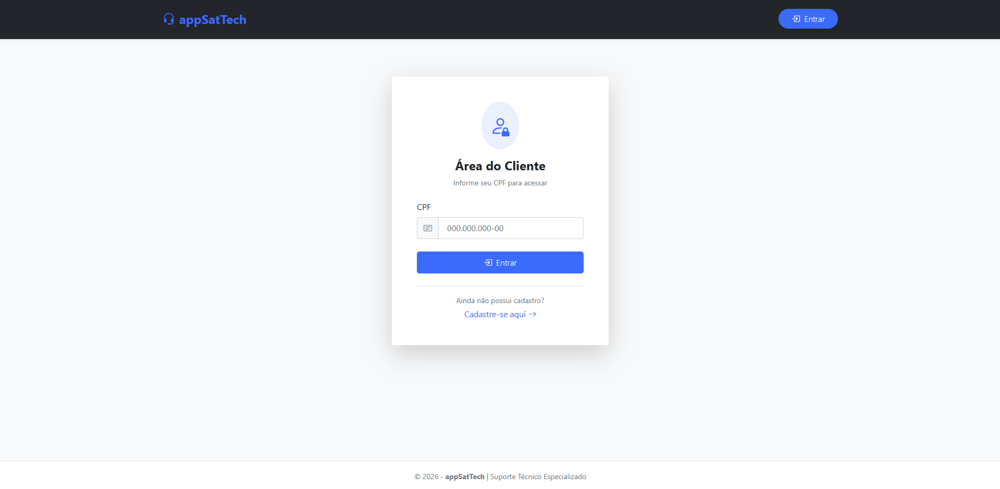
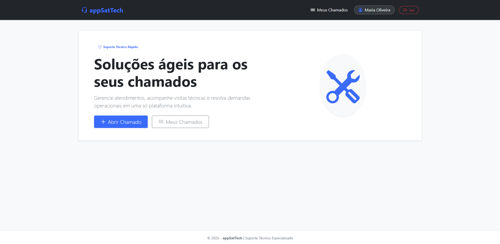
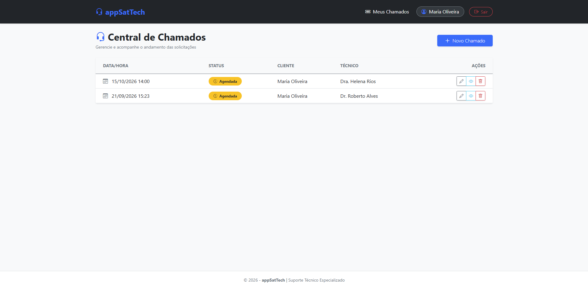

# 🛠️ appSatTech

<!-- Efeito de texto digitando automaticamente -->

  Uma solução moderna, intuitiva e eficiente para gerenciamento e acompanhamento de chamados técnicos.

<!-- Badges das Tecnologias -->

  
  
  
  
  

---

## 📸 Demonstração do Sistema

  
<b>🔐 1. Tela de Login</b> (Clique para recolher/expandir)

   
  

    
  

 

  
<b>🏠 2. Tela Principal (Usuário Logado)</b>

   
  

    
  

 

  
<b>📋 3. Central de Chamados (Listagem)</b>

   
  

    
  

---

## 👥 Créditos e Autoria

<table align="center" width="100%">
  <tr>
    <td align="center" width="50%">
      <b>👨‍💻 Desenvolvedor</b>  
      <code>Rodrigo Victor Damazio Costa Filho</code>
    </td>
    <td align="center" width="50%">
      <b>👨‍🏫 Tutor / Orientador</b>  
      <code>Wallace Oliveira dos Santos</code>
    </td>
  </tr>
</table>

  ✨ Projeto appSatTech

